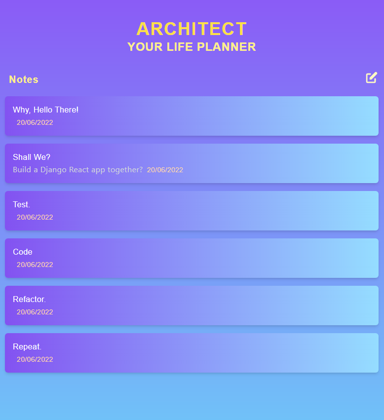

# Architect



Architect is a RESTFUL notes app built using Django and React.js/Redux. A Test Driven Development approach was utilised throughout to ensure the application was bug free. You can follow the development process and code along with me in [this Medium blog tutorial](https://medium.com/@ellenst264/build-a-notes-app-with-django-react-redux-tdd-approach-part-1-9486ded810ae)

---

## Local Deployment

### Cloning the Repistory

--> Input the following command in your terminal:

```
$ git clone https://github.com/EllenSt264/Architect.git <where-you-want-to-install>/architect
```

--> CD into the project directory:

```
$ cd <directory>/architect
```

--> Create a virtual enviornment:

```
# If yon Windows
$ virtualenv .venv

# If on Linux or Mac
$ python3 -m venv .venv
```

--> Activate virtual enviornment:

```
# If yon Windows
$ .venv\scripts\activate

# If on Linux or Mac
$ source .venv/bin/activate
```

--> Install required Python packages:

```
$ pip install -r requirements.txt
```

--> Install required node modules:

```
$ npm install
```

### Setup env.py file

--> Create a 'env.py' file and open it up in your IDE. Add the following:

```
import os

os.environ.setdefault("DEVELOPMENT", "True")
os.environ.setdefault("SECRET_KEY", "<YOUR_SECREY_KEY>")
```

### Running the App

--> Run the development server with the following command:

```
$ python manage.py runserver
```

--> If you want to see any changes made to the application then run node:

```
$ npm run dev
```
